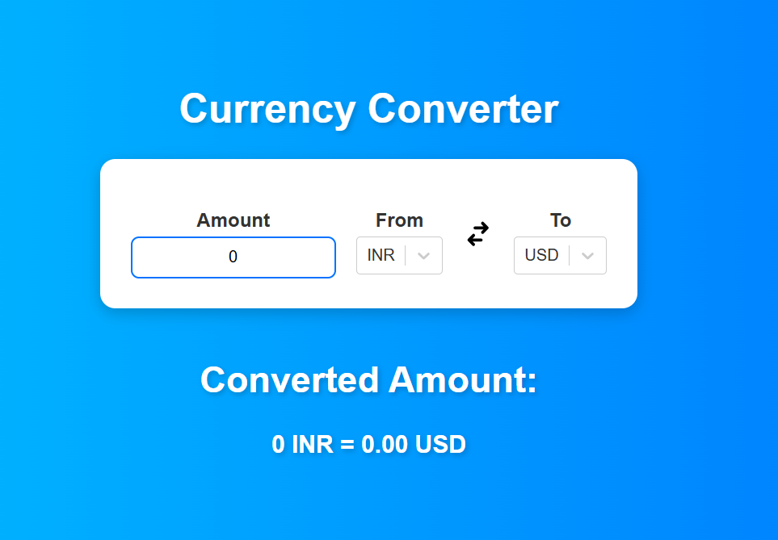

# React-Currency-Converter
React-Currency-Converter is a user-friendly web application built with React.js that allows users to convert amounts between different currencies quickly and accurately. With real-time exchange rates, this tool is perfect for travelers, business professionals, and anyone in need of currency conversion.


### **React Currency Converter** 🌍💱  
A simple and interactive currency converter built with **React.js**, **Axios**, and **React-Select**.  

  
 


## 🚀 **Features**  
✅ Real-time currency conversion using API  
✅ Modern UI with **React-Select** dropdowns  
✅ Swap currency functionality  
✅ Responsive design for mobile & desktop  
✅ Smooth animations and hover effects  


## 📦 **Tech Stack**  
- **Frontend**: React.js, React-Select  
- **API**: [Currency API](https://github.com/fawazahmed0/currency-api)  
- **Styling**: CSS3, Flexbox  


## 🔧 **Installation & Setup**  

### **1️⃣ Clone the Repository**  
```bash
git clone https://github.com/vikarnjha/React-Currency-Converter.git
cd react-currency-converter


### **2️⃣ Install Dependencies**  

npm install


### **3️⃣ Run the Project Locally**  

npm run dev


🚀 The app will be live at **http://localhost:5173** (or the port Vite assigns).  

---

## 🌍 **Deployment on Vercel**  
1️⃣ **Build the project**  

npm run build

2️⃣ **Deploy using Vercel CLI**  

vercel


## 📸 **Screenshots**  
*()*  


## 👨‍💻 **Contributing**  
1. **Fork** the repository  
2. **Create** a new branch (`git checkout -b feature-branch`)  
3. **Commit** your changes (`git commit -m "Added a new feature"`)  
4. **Push** to GitHub (`git push origin feature-branch`)  
5. **Open a Pull Request** 🎉  


## 📜 **License**  
This project is licensed under the **MIT License**.  


💙 **Star this repo** if you like it! ⭐  
Happy coding! 🚀  